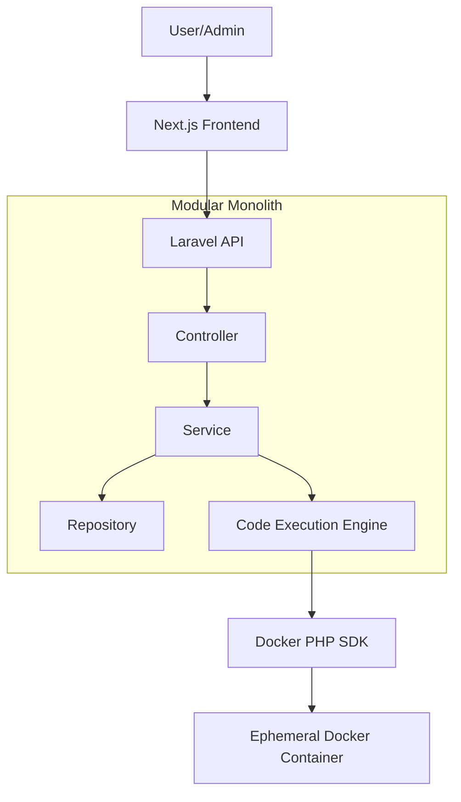
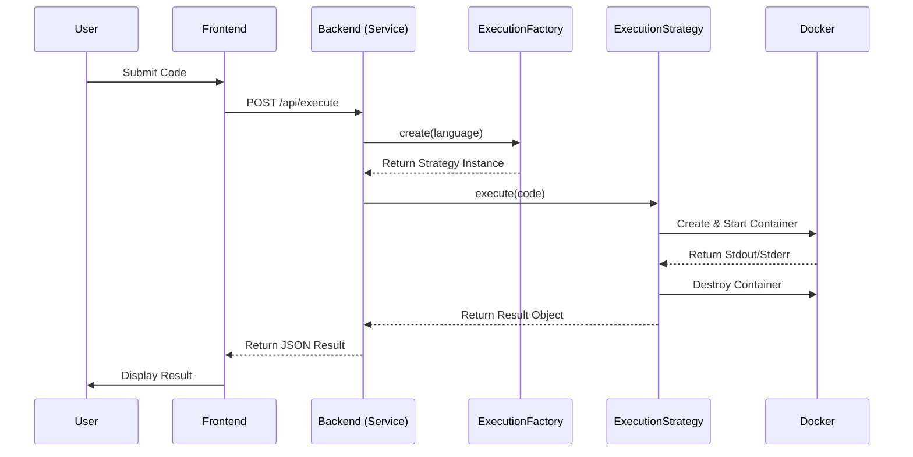

# Design Document: dev-init

## Overview
**Purpose**: 「DevInit」は、初学者がブラウザ上で即座にプログラミング演習を行える環境を提供します。
**Users**: 初学者ユーザー（演習実施）、管理者（教材管理）。
**Impact**: ローカル環境構築の壁を取り払い、Webブラウザのみで学習を完結させます。

### Goals
- ブラウザ完結型のコード編集・実行環境の提供
- Dockerを利用した隔離された安全な実行基盤の構築
- 将来的な多言語対応を可能にする拡張性の確保（Strategyパターン）
- 堅牢なレイヤードアーキテクチャによる保守性の向上

### Non-Goals
- 本番環境レベルの複雑なインフラ構成（初期はシングルサーバー想定）
- 高度なIDE機能（LSP連携等はMVP対象外）
- ユーザー間のソーシャル機能

## Boundary Commitments
### This Spec Owns
- フロントエンド（Next.js）の演習・管理画面
- バックエンド（Laravel）のAPIおよびビジネスロジック
- 実行エンジン（Docker連携）のライフサイクル管理
- 教材データおよびユーザー進捗のデータモデル

### Out of Boundary
- ホストOSのセキュリティ設定（Dockerデーモンの権限管理等）
- 外部認証プロバイダ（NextAuth等のライブラリに依存）

## Architecture
### Architecture Pattern & Boundary Map
**Selected Pattern**: APIベースのモジュラーモノリス。
- **Frontend (Next.js)**: UIおよび状態管理を担当。
- **Backend (Laravel)**: ビジネスロジック、データ永続化、外部プロセス（Docker）制御を担当。



### Technology Stack
| Layer | Choice / Version | Role in Feature |
|-------|------------------|-----------------|
| Frontend | Next.js 14+ / TypeScript | SPA、Markdown表示、コード編集 |
| Backend | Laravel 10+ / PHP 8.2+ | API、ビジネスロジック、Docker制御 |
| Database | PostgreSQL | 教材、ユーザー、実行ログの保存 |
| Infrastructure | Docker | 隔離されたユーザーコードの実行環境 |

## File Structure Plan
### Directory Structure
```
/
├── frontend/                # Next.js Application
│   ├── src/
│   │   ├── components/      # UI Components (Editor, Viewer)
│   │   ├── services/        # API Clients
│   │   └── types/           # Frontend Types
├── backend/                 # Laravel Application
│   ├── app/
│   │   ├── Modules/
│   │   │   ├── Education/   # 教材管理モジュール
│   │   │   └── Execution/   # 実行エンジンモジュール (Strategy/Factory適用)
│   │   │       ├── Contracts/
│   │   │       ├── Factories/
│   │   │       └── Strategies/
│   │   ├── Http/Controllers/
│   │   ├── Services/
│   │   └── Repositories/
│   └── tests/               # PHPUnit Tests
└── docker/                  # Dockerfiles for execution environments
```

## System Flows
### Code Execution Flow


## Components and Interfaces

### Execution Module

| Component | Domain/Layer | Intent | Req Coverage | Key Dependencies | Contracts |
|-----------|--------------|--------|--------------|--------------------------|-----------|
| ExecutionFactory | Execution | 言語に応じたStrategyを生成 | 3.1, 4.3 | ExecutionStrategy | Factory |
| PythonStrategy | Execution | PythonコードをDockerで実行 | 1.2, 3.2 | Docker SDK | Strategy |
| ExecutionService | Backend | 実行フローのオーケストレーション | 1.2 | ExecutionFactory, Repository | Service |

#### ExecutionStrategy Interface
```php
interface ExecutionStrategy {
    /**
     * @param string $code 実行するソースコード
     * @return ExecutionResult 実行結果（出力、エラー、実行時間等）
     */
    public function execute(string $code): ExecutionResult;
}
```

#### API Contract
| Method | Endpoint | Request | Response | Errors |
|--------|----------|---------|----------|--------|
| POST | /api/execute | { language: string, code: string } | { output: string, exit_code: int } | 400, 422, 500 |
| GET | /api/problems | - | Array<Problem> | 500 |

## Data Models
### Domain Model
- **Problem**: タイトル、本文（MD）、模範解答、制限時間（Timeout）。
- **Submission**: ユーザー、問題、提出コード、実行結果、ステータス。

### Physical Data Model (PostgreSQL)
- `problems`: `id`, `title`, `content`, `model_answer`, `timeout`, `created_at`, `updated_at`
- `submissions`: `id`, `user_id`, `problem_id`, `code`, `result_output`, `status`, `created_at`

## Error Handling
### Error Strategy
- **User Code Error**: コンテナの標準エラー出力をキャプチャし、200 OKのレスポンス内で「実行エラー」として返す。
- **Timeout**: 実行時間が閾値を超えた場合、コンテナを強制終了し、「Time Limit Exceeded」を返す。
- **System Error**: 500 Internal Server Errorを返し、ログに詳細を記録する。

## Testing Strategy
- **Unit Tests**: `ExecutionFactory`が正しいStrategyを返すか、`ExecutionResult`のパース処理等。
- **Integration Tests**: 実際にDockerコンテナを立ち上げ、簡単なコード（`print('hello')`）が実行され結果が返るか。
- **API Tests**: Laravelの`TestCase`を用いたエンドポイントの正常・異常系テスト。
