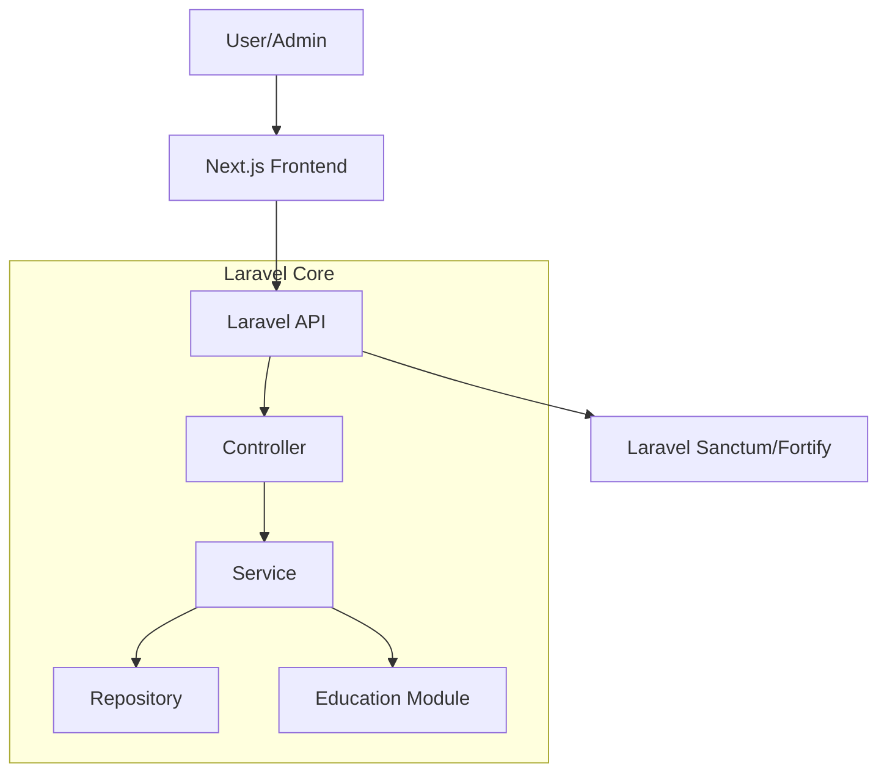
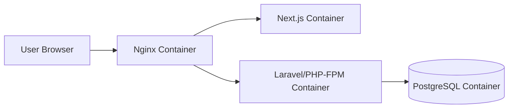
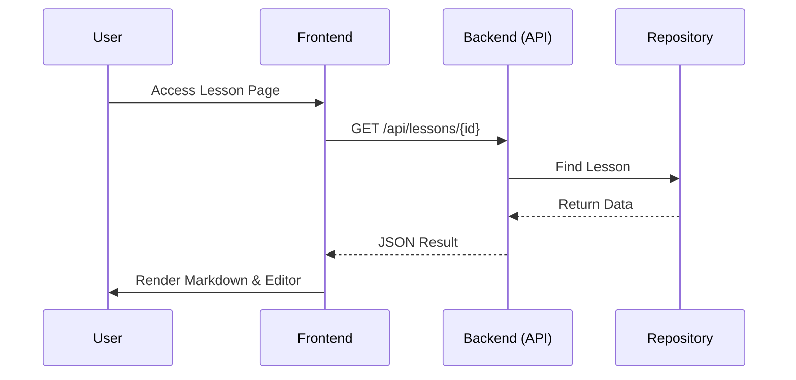

# Design Document: dev-init

## Overview
**Purpose**: 「DevInit」は、初学者がブラウザ上で即座にプログラミング学習を開始できる環境を提供します。
**Users**: 初学者ユーザー（演習実施）、管理者（教材管理）。
**Impact**: MVPではブラウザ完結型のコード編集・保存機能を中核とし、学習の継続性を担保します。

### Goals
- Next.jsとLaravelを組み合わせたAPIベースのSPA構築
- 教材表示（Markdown）とコードエディタ（Monaco等）の統合
- ユーザー認証と教材管理（CRUD）の実現
- 将来のコード実行エンジン（Docker等）を容易に追加できるモジュール構造

### Non-Goals (Future Extensions)
- **Dockerコンテナによるコード実行機能（フェーズ2）**
- 実行結果のキャプチャとフィードバック表示
- 高度なIDE機能

## Boundary Commitments
### This Spec Owns
- フロントエンド（Next.js）の演習・管理・認証画面
- バックエンド（Laravel）のAPIおよびビジネスロジック
- 教材データおよびユーザー進捗のデータモデル

### Out of Boundary
- ホストOSのセキュリティ設定
- 実行環境のインフラ自動構築

## Architecture
### Architecture Pattern & Boundary Map
**Selected Pattern**: APIベースのモジュラーモノリス（準備段階）。
- **Frontend (Next.js)**: UIおよびフロントエンドの状態管理。
- **Backend (Laravel)**: ビジネスロジック、認証、データ永続化。



### Technology Stack
| Layer | Choice / Version | Role in Feature |
|-------|------------------|-----------------|
| Infrastructure | Docker / Docker Compose | 開発環境のコンテナ化（Frontend, Backend, DB） |
| Frontend | Next.js 14+ / TypeScript | SPA、Markdown表示、コード編集、認証UI |
| Backend | Laravel 10+ / PHP 8.2+ | API、ビジネスロジック、認証機能 |
| Database | PostgreSQL | レッスン、ユーザー、提出コードの保存 |
| Authentication | Laravel Sanctum | APIベースのトークン認証 |

## File Structure Plan
### Directory Structure
```
/
├── frontend/                # Next.js Application
├── backend/                 # Laravel Application
├── docker/                  # Docker configuration files
│   ├── nginx/               # Nginx reverse proxy config
│   ├── php/                 # PHP-FPM config
│   └── postgres/            # DB init scripts (if any)
├── docker-compose.yml       # Orchestration for development
└── .env.example             # Shared environment template
```

## Architecture
### Infrastructure Map (Docker)


## System Flows
### Content Access Flow


## Components and Interfaces

### Education Module

| Component | Layer | Intent | Req Coverage |
|-----------|-------|--------|--------------|
| LessonService | Service | レッスンの検索、作成、更新を制御 | 2.1, 2.2 |
| SubmissionService | Service | ユーザーが記述したコードの保存と復元 | 1.4 |

### Identity Module

| Component | Layer | Intent | Req Coverage |
|-----------|-------|--------|--------------|
| AuthController | Http | ログイン・登録エンドポイント | 3.1, 3.2 |
| UserService | Service | ユーザー情報の取得、権限チェック | 3.3 |

## Data Models
### Domain Model
- **User**: ID, Name, Email, Password, Role (Admin/User).
- **Lesson**: ID, Title, Content (MD), Model Answer, CreatedAt.
- **Submission**: ID, UserID, LessonID, Code, Status (Saved), UpdatedAt.

### Physical Data Model (PostgreSQL)
- `users`: `id`, `name`, `email`, `password`, `role`, `created_at`
- `lessons`: `id`, `title`, `content`, `model_answer`, `created_at`, `updated_at`
- `submissions`: `id`, `user_id`, `lesson_id`, `code`, `status`, `updated_at`

## Error Handling
### Error Strategy
- **Auth Error**: 401 Unauthorized または 403 Forbidden を返却し、フロントエンドでログイン画面へ誘導。
- **Validation Error**: 422 Unprocessable Entity を返却し、エラーメッセージを表示。
- **System Error**: 500 Internal Server Errorを返し、ログに詳細を記録する。

## Testing Strategy
- **API Tests**: Laravelの`TestCase`を用いたエンドポイントの正常・異常系テスト（CRUD, Auth）。
- **Unit Tests**: 権限チェックロジックや、Markdownパースの補助処理など。
- **Frontend Tests**: 基本的なコンポーネントのレンダリングテスト。
