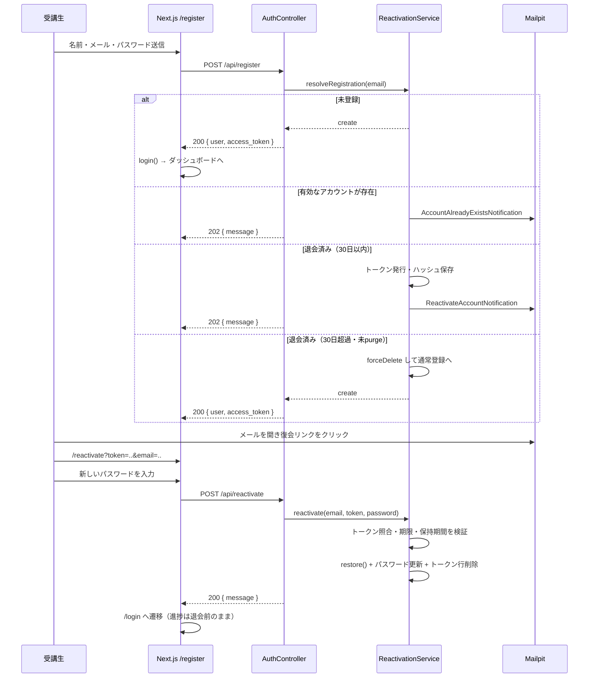
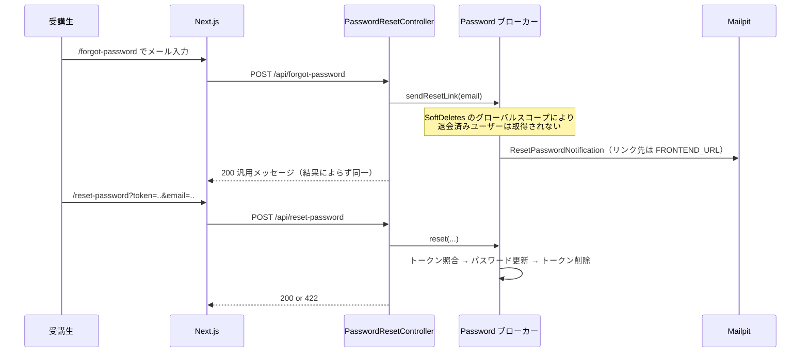
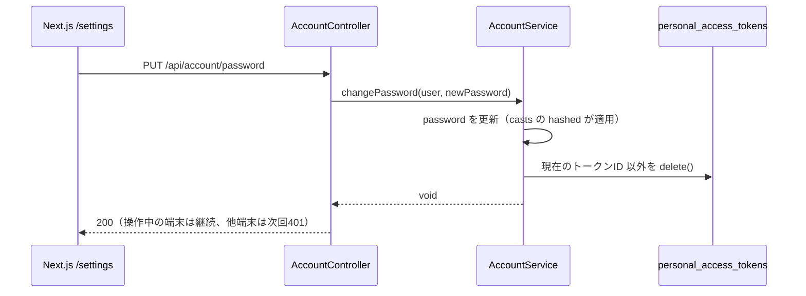

# 技術設計: Phase 15 - 学生アカウント機能の整備

## 設計方針の要点

- `User` に `SoftDeletes` を導入する。Laravelのグローバルスコープにより、**退会済みユーザーは既存クエリから自動的に消える**（ログイン検索・`UserRepository::all()`・Sanctumの `tokenable` 解決・`Password` ブローカーのユーザー取得がすべて対象外になる）。既存コードに条件分岐を足すのではなく、この「見えなくなる」性質に乗る形で US-3・US-4・US-7 の大半を満たす。
- アカウント系の責務は `AuthController` に足さず、**用途ごとにController/Serviceを分割**する（`AccountController` / `PasswordResetController` / `ReactivationController`）。`AuthController::register` だけは、退会済みメール検知の分岐を持つため `ReactivationService` に委譲する。
- 復会トークンは `password_reset_tokens` を流用せず、**専用テーブル `account_reactivation_tokens` を新設**する。理由: 標準の `Password` ブローカーは `users` プロバイダ経由でユーザーを取得するため、ソフトデリート済みユーザーを引けない。ブローカーを退会済みも見えるように歪めると、パスワードリセット側の「退会済みには送らない」保証（US-3）まで壊れる。テーブル構造はLaravel標準の `password_reset_tokens` に揃える（email主キー・トークンはハッシュ保存・単回使用）。
- **`POST /register` のレスポンス契約を変更する**。「メールアドレスの登録状態を推測させない」（US-5）を満たすため、既に使われているメールアドレス（有効・退会済みの両方）では **202 + 汎用メッセージ** を返し、アカウントの存在有無に応じたメールを送る。未登録のメールアドレスのみ従来どおり 200 + トークンを返す。→ 影響が大きいため §13 に整理し、代替案も併記した。**レビュー時にここを確認してほしい。**
- パスワードリセット・復会の完了後は**トークンを自動発行しない**。完了画面からログイン画面へ誘導し、新しいパスワードでログインさせる（Laravel標準のリセットフローと同じ挙動。メールリンクの所持だけでセッションが手に入る状態を避ける）。
- メール本文はすべて日本語のため、Laravel標準の `ResetPassword` 通知はそのまま使わず**自前の Notification クラス**を用意する（リンク先をフロントエンドURLへ向ける件も同時に解決する）。
- 保持期間（30日）とトークン有効期限は `config/account.php` に集約し、Artisanコマンド・復会検証・画面文言の根拠を一箇所にする。

---

## 1. データモデル

### 1.1 マイグレーション

| ファイル（新規） | 内容 |
|---|---|
| `2026_08_05_000000_add_deleted_at_to_users_table.php` | `users` に `softDeletes()`（`deleted_at` nullable timestamp）を追加 |
| `2026_08_05_000001_create_account_reactivation_tokens_table.php` | 復会トークン保管テーブルを新設 |

```php
// 2026_08_05_000001_create_account_reactivation_tokens_table.php
Schema::create('account_reactivation_tokens', function (Blueprint $table) {
    $table->string('email')->primary();
    $table->string('token');            // Hash::make() 済みの値のみ保存
    $table->timestamp('created_at')->nullable();
});
```

`users.email` の unique 制約は**変更しない**。退会済みレコードがメールアドレスを保持し続けることが「30日間は同じメールで新規登録できず、復会に誘導される」という仕様そのものになるため。保持期間を過ぎたレコードは §8 のコマンドで物理削除され、その時点でメールアドレスが解放される。

### 1.2 `app/Models/User.php`

```php
use Illuminate\Database\Eloquent\SoftDeletes;

class User extends Authenticatable
{
    use HasApiTokens, HasFactory, Notifiable, SoftDeletes;

    // パスワードリセット通知を日本語＋フロントエンドURL向けに差し替える
    public function sendPasswordResetNotification($token): void
    {
        $this->notify(new ResetPasswordNotification($token));
    }
}
```

`#[Hidden(['password', 'remember_token'])]` はそのまま。`deleted_at` は管理画面の退会済み一覧で使うため隠さない。

### 1.3 `config/account.php`（新規）

```php
return [
    // 退会後、完全削除されるまでの日数（US-4/US-6の「30日」の唯一の根拠）
    'retention_days' => (int) env('ACCOUNT_RETENTION_DAYS', 30),

    // 復会トークンの有効期限（分）。password_reset_tokens の expire=60 に揃える
    'reactivation_token_expire' => (int) env('ACCOUNT_REACTIVATION_TOKEN_EXPIRE', 60),
];
```

`config/app.php` に `'frontend_url' => env('FRONTEND_URL', 'http://localhost:3000')` を追加する（メール内リンクの生成に使う）。

---

## 2. バックエンドのレイヤー配置

`structure.md` の依存方向（Controller → Service → Repository）を守り、新規クラスを以下に置く。

### 2.1 新規クラス一覧

| レイヤー | クラス | 責務 |
|---|---|---|
| Controller | `App\Http\Controllers\AccountController` | 自分のプロフィール更新 / パスワード変更 / 退会 |
| Controller | `App\Http\Controllers\PasswordResetController` | リセットリンク送信 / パスワード再設定 |
| Controller | `App\Http\Controllers\ReactivationController` | 復会の実行 |
| Service | `App\Services\AccountService` | プロフィール更新・パスワード変更・退会のドメインロジック |
| Service | `App\Services\PasswordResetService` | `Password` ファサードのラップ、結果ステータスの変換 |
| Service | `App\Services\ReactivationService` | 復会リンク送信判定・トークン発行・検証・復元 |
| Repository | `App\Repositories\ReactivationTokenRepository` | `account_reactivation_tokens` へのアクセス |
| Command | `App\Console\Commands\PurgeDeletedUsers` | 保持期間超過ユーザーの物理削除 |
| Notification | `App\Notifications\ResetPasswordNotification` | パスワードリセットメール（日本語） |
| Notification | `App\Notifications\ReactivateAccountNotification` | 復会案内メール（日本語） |
| Notification | `App\Notifications\AccountAlreadyExistsNotification` | 登録済みメールへの案内メール（日本語） |

### 2.2 FormRequest（Phase 14 の方針を踏襲し、Controller内 `validate()` 直書きは禁止）

| クラス（新規） | 対象 | ルール要点 |
|---|---|---|
| `UpdateProfileRequest` | `PUT /account/profile` | `name`: `sometimes`, `required`, `string`, `max:255`<br>`email`: `sometimes`, `required`, `email`, `max:255`, `Rule::unique('users')->ignore($this->user()->id)` |
| `UpdatePasswordRequest` | `PUT /account/password` | `current_password`: `required`, `string`, `current_password:sanctum`<br>`password`: `required`, `string`, `min:8`, `confirmed` |
| `DeleteAccountRequest` | `DELETE /account` | `password`: `required`, `string`, `current_password:sanctum` |
| `ForgotPasswordRequest` | `POST /forgot-password` | `email`: `required`, `email` |
| `ResetPasswordRequest` | `POST /reset-password` | `token`: `required`, `string`<br>`email`: `required`, `email`<br>`password`: `required`, `string`, `min:8`, `confirmed` |
| `ReactivateAccountRequest` | `POST /reactivate` | `ResetPasswordRequest` と同一ルール |
| `Admin\IndexUserRequest` | `GET /admin/users` | `status`: `sometimes`, `in:active,deleted` |

`current_password:sanctum` は、現在のパスワード照合に使うガードを Sanctum に指定するもの（デフォルトの `web` ガードはセッション認証のため、Bearer トークン運用では認証済みユーザーを取得できない）。

`authorize()` はPhase 14 と同じ方針（ルートミドルウェアで担保済みのため `true` を返し、その旨をコメントで残す）。

**`UpdateProfileRequest` の unique 判定について**: `Rule::unique` はモデルではなくテーブルを直接見るため、退会済みユーザーが保持しているメールアドレスも「使用中」として 422 になる。DBのunique制約違反（500）を防ぐ意味でこれが正しい挙動であり、`whereNull('deleted_at')` は**付けない**。

**`RegisterRequest` の変更**: `email` から `unique:users` を**外す**（§5.1 の分岐で扱うため）。

**`Admin\StoreUserRequest`**: `unique:users` はそのまま残すが、退会済みメールと衝突したときに管理者が原因を判断できるよう `messages()` に「退会済みユーザーが使用中の可能性があります」旨を追記する。

---

## 3. API設計

### 3.1 エンドポイント一覧

| # | メソッド | パス | 認証 | リミッター | 概要 |
|---|---|---|---|---|---|
| 1 | PUT | `/api/account/profile` | `auth:sanctum` | `throttle:api` | 名前・メールの更新 |
| 2 | PUT | `/api/account/password` | `auth:sanctum` | `throttle:account` | パスワード変更 |
| 3 | DELETE | `/api/account` | `auth:sanctum` | `throttle:account` | 退会（ソフトデリート） |
| 4 | POST | `/api/forgot-password` | なし | `throttle:auth` | リセットリンク送信 |
| 5 | POST | `/api/reset-password` | なし | `throttle:auth` | パスワード再設定 |
| 6 | POST | `/api/reactivate` | なし | `throttle:auth` | 復会の実行 |
| 7 | GET | `/api/admin/users?status=deleted` | `auth:admin` | `throttle:api` | 退会済み一覧（既存拡張） |
| 8 | DELETE | `/api/admin/users/{id}/force` | `auth:admin` | `throttle:api` | 完全削除（物理削除） |

`/account/*` のプレフィックスは「自分自身のアカウント」を意味し、管理者の `/admin/users/*`（他人のアカウント）と URL 上で明確に区別する。

### 3.2 リクエスト / レスポンス

#### 1. `PUT /api/account/profile`

```jsonc
// Request
{ "name": "山田 太郎", "email": "taro@example.com" }
// 200
{ "id": 1, "name": "山田 太郎", "email": "taro@example.com", "created_at": "...", "updated_at": "..." }
// 422: メール重複 / 401: 未認証
```

#### 2. `PUT /api/account/password`

```jsonc
// Request
{ "current_password": "old-pass", "password": "new-pass", "password_confirmation": "new-pass" }
// 200
{ "message": "パスワードを変更しました。他の端末は再ログインが必要です。" }
// 422: 現在のパスワード誤り / 新パスワードのルール違反
```

#### 3. `DELETE /api/account`

```jsonc
// Request
{ "password": "current-pass" }
// 200
{ "message": "退会が完了しました。" }
// 422: パスワード誤り
```

#### 4. `POST /api/forgot-password` / 5. `POST /api/reset-password`

```jsonc
// forgot-password Request: { "email": "taro@example.com" }
// 200（登録有無・退会有無にかかわらず常に同一）
{ "message": "メールアドレスが登録されている場合、パスワード再設定用のリンクを送信しました。" }

// reset-password Request: { "token": "...", "email": "...", "password": "...", "password_confirmation": "..." }
// 200
{ "message": "パスワードを再設定しました。新しいパスワードでログインしてください。" }
// 422: トークン不正・期限切れ・使用済み（errors.email に格納）
```

#### 6. `POST /api/reactivate`

```jsonc
// Request: { "token": "...", "email": "...", "password": "...", "password_confirmation": "..." }
// 200
{ "message": "アカウントを復元しました。新しいパスワードでログインしてください。" }
// 422: トークン不正・期限切れ・使用済み・保持期間超過
```

#### 7. `POST /api/register`（契約変更）

```jsonc
// 未登録メール → 200（従来どおり）
{ "user": {...}, "access_token": "...", "token_type": "Bearer" }

// 既に使われているメール（有効・退会済みのいずれも）→ 202
{ "message": "ご入力のメールアドレス宛に確認メールを送信しました。メールをご確認ください。" }
```

---

## 4. 主要フローのシーケンス

### 4.1 新規登録と復会



### 4.2 パスワードリセット



### 4.3 パスワード変更（他端末のトークン失効）



---

## 5. Service 実装方針

### 5.1 `ReactivationService`

```php
class ReactivationService
{
    public function __construct(
        protected UserRepository $users,
        protected ReactivationTokenRepository $tokens,
    ) {}

    /**
     * 登録時の分岐判定。呼び出し元（AuthController）は戻り値で
     * 「即時登録する / 案内メールを送って 202 を返す」を決める。
     */
    public function resolveRegistration(array $data): ?User
    {
        $active = $this->users->findByEmail($data['email']);
        if ($active) {
            $active->notify(new AccountAlreadyExistsNotification());
            return null;                       // 202 汎用メッセージ
        }

        $trashed = $this->users->findTrashedByEmail($data['email']);
        if ($trashed && $this->isWithinRetention($trashed)) {
            $this->sendReactivationLink($trashed);
            return null;                       // 202 汎用メッセージ
        }

        // 保持期間を過ぎた退会済みレコードが purge 前に残っている場合は
        // ここで解放し、通常の新規登録として扱う（US-5 の受け入れ条件）
        $trashed?->forceDelete();

        return $this->users->create([...]);    // 200 + トークン
    }
}
```

- **トークン**: `Str::random(64)` を生成しメールに載せ、DBには `Hash::make()` した値のみ保存する。検証は `Hash::check()`。既存行があれば削除してから発行し、常に最新の1本だけ有効にする。
- **単回使用**: `reactivate()` 成功時に該当行を削除する。2回目は行が無く 422。
- **復会時の氏名**: 退会前の値を維持する。登録フォームに入力された名前は**採用しない**（メール受信者以外の入力を検証前に反映させないため）。復会後に `/settings` から変更できる旨をメール本文に書く。
- **失敗時の例外**: `ValidationException::withMessages(['email' => [...]])` で送出し、Laravel標準の 422 JSON 構造に揃える（Phase 14 のエラー契約を維持）。

### 5.2 `AccountService`

```php
public function changePassword(User $user, string $password, ?PersonalAccessToken $current): void
{
    $user->forceFill(['password' => $password])->save();   // casts の 'hashed' がハッシュ化

    $user->tokens()
        ->when($current, fn ($q) => $q->where('id', '!=', $current->id))
        ->delete();
}

public function delete(User $user): void
{
    $user->tokens()->delete();   // 退会後に既存トークンが残らないようにする
    $user->delete();             // SoftDeletes → deleted_at をセット
}
```

`currentAccessToken()` は `Sanctum::actingAs()` 使用時に `TransientToken`（`id` を持たない）を返すため、`PersonalAccessToken` インスタンスかどうかで分岐する。テスト側も実際にログインして得た本物のトークンを使う（§11 参照）。

`delete()` で明示的にトークンを消しているが、仮に消し漏れても Sanctum は `tokenable`（morphTo）解決時に SoftDeletes のグローバルスコープで退会済みユーザーを引けず 401 になる。二重に担保する。

### 5.3 `UserRepository` の追加メソッド

```php
public function findByEmail(string $email): ?User;              // 有効なユーザーのみ
public function findTrashedByEmail(string $email): ?User;       // onlyTrashed()
public function allTrashed(): Collection;                       // 管理画面の退会済み一覧
public function findWithTrashed(int $id): ?User;                // 完全削除の対象取得
public function restore(User $user): bool;
public function forceDelete(User $user): bool;
public function trashedOlderThan(CarbonInterface $threshold): Collection;
```

---

## 6. 通知（メール）設計

いずれも `Notification` を継承し `toMail()` のみ実装する。`ShouldQueue` は**付けない**（キューワーカーを別途常駐させる必要が出るため。登録・リセット要求のレスポンスにSMTP送信の待ち時間が乗るが、Mailpit／MVP規模では許容する）。

| クラス | 件名 | 本文の要点 |
|---|---|---|
| `ResetPasswordNotification` | 【DevInit】パスワード再設定のご案内 | `{FRONTEND_URL}/reset-password?token={token}&email={urlencode(email)}` / 有効期限60分 / 心当たりがなければ破棄してよい旨 |
| `ReactivateAccountNotification` | 【DevInit】アカウント復元のご案内 | `{FRONTEND_URL}/reactivate?token={token}&email={urlencode(email)}` / 有効期限60分 / 復元すると以前の学習進捗を引き継ぐ旨 / 氏名は退会前のままで設定画面から変更できる旨 |
| `AccountAlreadyExistsNotification` | 【DevInit】アカウント登録のお知らせ | 既に登録済みのためログインしてほしい旨 / パスワードを忘れた場合は `{FRONTEND_URL}/forgot-password` へ / 心当たりがなければ破棄してよい旨（**リンクにトークンは含めない**） |

`ResetPasswordNotification` は `User::sendPasswordResetNotification()` のオーバーライドから呼ばれるため、`Password` ブローカー経由で自動的に使われる。`ResetPassword::createUrlUsing()` は使わない（メール文面も日本語化するため、通知クラスごと差し替えたほうが一箇所で完結する）。

---

## 7. レート制限

`AppServiceProvider::configureRateLimiting()` にリミッターを1つ追加する。

```php
// 自分のアカウントに対する機微な操作（パスワード変更・退会）。
// 'auth' と同じ厳しさだが、リクエストボディに email が無いため
// 認証済みユーザーIDでキーを引く。
RateLimiter::for('account', function (Request $request) {
    return Limit::perMinute(6)->by($request->user()?->id ?: $request->ip());
});
```

`/forgot-password` `/reset-password` `/reactivate` は既存の `auth` リミッター（IP + email で6回/分）をそのまま使う。いずれもボディに `email` を含むため、キー生成がそのまま機能する。

`routes/api.php` への追加:

```php
// 公開グループ（既存の throttle:auth グループに追加）
Route::post('/forgot-password', [PasswordResetController::class, 'sendResetLink']);
Route::post('/reset-password', [PasswordResetController::class, 'reset']);
Route::post('/reactivate', ReactivationController::class);

// auth:sanctum グループ内
Route::middleware('throttle:api')->group(function () {
    Route::put('/account/profile', [AccountController::class, 'updateProfile']);
});
Route::middleware('throttle:account')->group(function () {
    Route::put('/account/password', [AccountController::class, 'updatePassword']);
    Route::delete('/account', [AccountController::class, 'destroy']);
});

// auth:admin グループ内（既存の /users 群に追加）
Route::delete('/users/{id}/force', [UserController::class, 'forceDestroy']);
```

---

## 8. Artisanコマンドとスケジューラ

### 8.1 `App\Console\Commands\PurgeDeletedUsers`

```php
protected $signature = 'users:purge-deleted {--days= : 保持日数（未指定なら config/account.php）} {--dry-run}';
protected $description = '保持期間を過ぎた退会済みユーザーを完全に削除する';
```

- 閾値: `now()->subDays($days ?? config('account.retention_days'))`。`deleted_at < 閾値` のユーザーのみ対象（`onlyTrashed()`）。
- `--dry-run` 指定時は件数と対象メールアドレスを出力するだけで削除しない。
- 削除は `forceDelete()`。`submissions` は `cascadeOnDelete` 済みのため連鎖削除される。`personal_access_tokens` は退会時に削除済み。`account_reactivation_tokens` に残骸がある場合も同時に削除する。
- 実行結果を `Log::info('Purged deleted users', ['count' => $count, 'days' => $days])` で記録し、コンソールにも件数を出力する。

### 8.2 スケジュール登録（`routes/console.php`）

```php
use Illuminate\Support\Facades\Schedule;

Schedule::command('users:purge-deleted')
    ->dailyAt('03:00')
    ->withoutOverlapping();
```

### 8.3 開発環境でのスケジューラ実行（`docker-compose.yml`）

`php` サービスと同じイメージを使う `scheduler` サービスを追加する。ただし **Compose プロファイルで opt-in にする**（`docker compose up` の副作用で開発DBのユーザーが物理削除されるのを防ぐため）。

```yaml
  scheduler:
    build:
      context: .
      dockerfile: docker/php/Dockerfile
    volumes:
      - ./backend:/var/www/backend
    environment:
      DB_HOST: db
      DB_PORT: 5432
      DB_USERNAME: ${DB_USERNAME:-user}
      DB_PASSWORD: ${DB_PASSWORD:-password}
    command: php artisan schedule:work
    depends_on:
      - db
    profiles: ["scheduler"]
```

起動: `docker compose --profile scheduler up scheduler`。`docker/php/docker-entrypoint.sh` の Docker ソケット処理は `if [ -S /var/run/docker.sock ]` でガードされているため、ソケットを渡さないこの構成でもそのまま動く。

---

## 9. 管理者側の変更（US-7）

### 9.1 一覧のフィルタ

```php
// UserController::index
public function index(IndexUserRequest $request)
{
    return response()->json(
        $this->service->list($request->validated()['status'] ?? 'active')
    );
}

// UserService::list
public function list(string $status = 'active'): Collection
{
    return $status === 'deleted'
        ? $this->repository->allTrashed()
        : $this->repository->all();   // SoftDeletes により退会済みは自動的に除外される
}
```

`?status` 省略時は従来どおり有効なユーザーのみ。`UserRepository::all()` は `User::all()` のままで、グローバルスコープが退会済みを落とすため**変更不要**。受講生数などの集計も同じ理由で自動的に退会済みを除外する（現状、集計を行っている箇所は `DashboardService` の受講生本人向け進捗のみで、受講生数を数えている画面は存在しない）。

### 9.2 削除の二段階化

| 操作 | エンドポイント | 挙動 |
|---|---|---|
| 削除 | `DELETE /api/admin/users/{id}` | ソフトデリート + 該当ユーザーの全トークン失効（`UserService::delete` を `AccountService::delete` と同じ処理に揃える） |
| 完全削除 | `DELETE /api/admin/users/{id}/force` | `findWithTrashed()` で取得し `forceDelete()`。`users` と `submissions` を物理削除 |

完全削除は退会済み・有効を問わず実行できる（即時削除請求に応じるため）。誤操作防止はフロント側の二段階確認（§10.3）で担保する。

---

## 10. フロントエンド設計

### 10.1 新規ページ

| パス | 配置 | 認証 | 概要 |
|---|---|---|---|
| `/settings` | `src/app/(student)/settings/page.tsx` | 要 | プロフィール / パスワード変更 / 退会の3セクション |
| `/forgot-password` | `src/app/(student)/forgot-password/page.tsx` | 不要 | メール送信フォーム |
| `/reset-password` | `src/app/(student)/reset-password/page.tsx` | 不要 | 新パスワード設定 |
| `/reactivate` | `src/app/(student)/reactivate/page.tsx` | 不要 | 復会（新パスワード設定） |

`/reset-password` と `/reactivate` は `token` / `email` をクエリから読むためクライアントコンポーネントとし、`useSearchParams()` を使う箇所は `<Suspense>` で包む（Next.js のプリレンダリング要件）。実装前に `frontend/node_modules/next/dist/docs/` の該当ガイドで現行の API を確認する（`AGENTS.md` の指示）。

新規4画面はいずれも Phase 12 の方針どおり、最初から `dark:` バリアントを付けて実装する。フォーム部品は既存の `@/components/ui` の `Input` / `Button` を使う。

### 10.2 公開パス定義の一元化

現在、公開パスの配列が `context/AuthContext.tsx:69` と `components/MainLayout.tsx:12` に二重管理されている。新規に3パス増えるため、`src/lib/routes.ts` を新設して共有する。

```ts
// src/lib/routes.ts
export const PUBLIC_PATHS = [
  '/login',
  '/register',
  '/forgot-password',
  '/reset-password',
  '/reactivate',
] as const;

export const isPublicPath = (pathname: string): boolean =>
  (PUBLIC_PATHS as readonly string[]).includes(pathname);
```

`AuthContext`（未ログイン時のリダイレクト判定）と `MainLayout`（サイドバー非表示判定）の両方をこれに差し替える。

### 10.3 既存コンポーネントの変更

| ファイル | 変更内容 |
|---|---|
| `context/AuthContext.tsx` | `checkAuth` を `refreshUser` としても公開（プロフィール更新後の再取得用）。退会用に `clearSession()` を追加（`/logout` を叩かずトークン破棄 + `setUser(null)` + `/login` へ遷移）。公開パス判定を `lib/routes.ts` に差し替え |
| `components/Sidebar.tsx` | ナビゲーションに「設定」(`/settings`, `Settings` アイコン) を追加。`isActive` は既存の最長一致ロジックがそのまま使える |
| `components/MainLayout.tsx` | 公開パス判定を `lib/routes.ts` に差し替え |
| `app/(student)/login/page.tsx` | 「パスワードをお忘れの方」リンク（`/forgot-password`）を追加 |
| `app/(student)/register/page.tsx` | `POST /register` のレスポンス分岐を追加。`access_token` があれば従来どおり `login()`、無ければ（202）フォームを畳んで案内メッセージを表示する |

### 10.4 `/settings` の構成

3つのカードを縦に並べる。それぞれ独立したフォームで、独立して送信する。

1. **プロフィール** — 名前・メールアドレス。初期値は `useAuth().user`。保存成功時に `refreshUser()` を呼び、サイドバーの表示も更新する。422 の `errors.email` をフィールド下に表示する。
2. **パスワード変更** — 現在のパスワード / 新しいパスワード / 確認。成功時は入力欄をクリアし、「他の端末は再ログインが必要です」と表示する（ログアウトはしない）。
3. **退会** — 赤系の枠で区切る。「30日以内なら同じメールアドレスで復会でき、学習進捗も引き継げます。30日を過ぎるとデータは完全に削除されます」を常時表示。パスワード入力 + `confirm()` の二段階を経て `DELETE /api/account` を実行し、成功後 `clearSession()` でログイン画面へ遷移する。

管理画面（`app/(admin)/admin/users/page.tsx`）には「有効 / 退会済み」のタブを追加し、退会済みタブでは操作列を「完全削除」ボタンのみにする。完全削除は `confirm()` で「この操作は取り消せません。学習履歴も含めて完全に削除されます」と確認したうえで `DELETE /api/admin/users/{id}/force` を叩く。

---

## 11. インフラ・環境変数

### 11.1 Mailpit（`docker-compose.yml`）

```yaml
  mailpit:
    image: axllent/mailpit:latest
    ports:
      - "${MAILPIT_UI_PORT:-8025}:8025"   # Web UI
      - "${MAILPIT_SMTP_PORT:-1025}:1025" # SMTP
```

`php` サービスに `depends_on: [mailpit]` は付けない（メール送信できなくてもアプリは起動すべきなので、起動順序の結合を作らない）。

### 11.2 `backend/.env.example`

```diff
+FRONTEND_URL=http://localhost:3000
+ACCOUNT_RETENTION_DAYS=30
-MAIL_MAILER=log
+MAIL_MAILER=smtp
-MAIL_HOST=127.0.0.1
+MAIL_HOST=mailpit
-MAIL_PORT=2525
+MAIL_PORT=1025
-MAIL_FROM_ADDRESS="hello@example.com"
+MAIL_FROM_ADDRESS="noreply@devinit.local"
-MAIL_FROM_NAME="${APP_NAME}"
+MAIL_FROM_NAME="DevInit"
```

本番SMTPは `MAIL_*` の差し替えのみで切り替わる（プロバイダ選定は本フェーズ対象外）。

---

## 12. テスト設計

`phpunit.xml` の SQLite インメモリ設定をそのまま使う。メール送信は `Notification::fake()` で検証し、実SMTPに依存させない。

| ファイル（新規） | 主なケース |
|---|---|
| `tests/Feature/AccountTest.php` | プロフィール更新成功 / 自分の現在のメールのまま保存できる / 他人のメールで422 / 未認証401 / パスワード変更成功 / 現在パスワード誤りで422 / 変更後に他端末トークンが失効し操作端末は生存 / 退会でdeleted_atがセットされ全トークン失効 / 退会後にログイン不可 / 退会後も submissions が残る |
| `tests/Feature/PasswordResetTest.php` | 登録済み/未登録で同一メッセージ / 通知が送られる・送られない / リセット成功後に新パスワードでログイン可 / トークン再利用で422 / 改ざんトークンで422 / 退会済みには送信されない |
| `tests/Feature/ReactivationTest.php` | 退会済みメールで登録してもユーザーが増えない / 復会通知が送られる / 復会でdeleted_atがクリアされログイン可 / 退会前のsubmissionsが引き継がれる / トークン再利用で422 / 30日超過は復会不可 / 30日超過レコードがある状態での新規登録は成功する / 有効なメールでの登録は202かつ AccountAlreadyExistsNotification が飛ぶ / 未登録メールは従来どおり200+トークン |
| `tests/Feature/PurgeDeletedUsersTest.php` | 30日超過ユーザーが削除される（submissionsも連鎖削除） / 29日目は削除されない / 未退会は削除されない / `--dry-run` では削除されない / 件数がログ出力される |

**既存テストへの影響**

| ファイル | 影響 |
|---|---|
| `AuthTest::test_user_can_register` | 影響なし（未登録メールでの登録は 200 + トークンのまま） |
| `AuthTest` の重複メール登録ケース | 現状 `AuthTest` に重複登録の 422 を期待するケースは無いことを確認済み。仮に追加されていれば 202 期待へ更新する |
| `StudentManagementTest` | **要修正**。`test_admin_can_delete_student`（`tests/Feature/StudentManagementTest.php:89`）が `assertDatabaseMissing('users', ...)` を期待しており、ソフトデリート化で失敗する。`assertSoftDeleted('users', ...)` に更新し、あわせて完全削除（`/force`）で `assertDatabaseMissing` になるケースと、退会済みが一覧に出ない／`?status=deleted` で出るケースを追加する |
| `RateLimitingTest` | `throttle:account` を追加した2エンドポイントの429を1ケース追加する |

パスワード変更テストでは `Sanctum::actingAs()` を使わず、`POST /api/login` で実トークンを2本取得してから変更を実行し、「片方が生きて片方が死ぬ」ことを検証する（§5.2 の `TransientToken` 問題を踏むため）。

---

## 13. 既存挙動の変更点と互換性

| # | 変更 | 影響 | 判断 |
|---|---|---|---|
| 1 | `POST /register` が既存メールで **422 → 202 + 汎用メッセージ** | フロントの登録画面がレスポンス分岐を必要とする。「メールアドレスは既に使用されています」というエラーが出なくなり、ユーザーはメールを見るまで理由が分からない | US-5 の「登録済み・退会済みを問わず同一の案内メッセージ」を満たすための必須変更。**代替案**: 有効なメールは従来どおり 422 のままにし、退会済みのみ 202 とする。実装は単純で UX も維持できるが、レスポンスの違いから「このメールは退会済みである」ことが外部から判別できてしまう。→ 要件に明記された条件を優先して 202 統一を採用したが、UX を優先するなら代替案に切り替えられる。**レビュー判断ポイント** |
| 2 | `DELETE /api/admin/users/{id}` がソフトデリートに変わる | 管理者から見て「削除したのにメールアドレスを再利用できない」状況が生まれる | US-7 の要求どおり。完全削除の導線（`/force`）を同時に提供して回避可能にする |
| 3 | `RegisterRequest` から `unique:users` を外す | バリデーション層での重複保証が無くなる | 重複判定は `ReactivationService::resolveRegistration()` が担う。同時リクエストによる競合は DB の unique 制約が最後の砦になるため、`create()` を `QueryException`（unique violation）で捕捉し、その場合も 202 の汎用メッセージを返す |
| 4 | 登録・リセット要求のレスポンスに SMTP 送信時間が乗る | 数百ms程度の遅延 | キュー導入はワーカー常駐が必要なため見送る。将来 `ShouldQueue` を付ける際は `QUEUE_CONNECTION` とワーカーサービスをセットで追加する |

---

## 14. 個人情報の取り扱い（requirements.md の注記への対応状況）

本フェーズで実装するのは削除・訂正の導線のみで、以下は**未整備のまま残る**（requirements.md の対象外リストどおり）。実装しないこと自体は判断済みだが、記録として残す。

- プライバシーポリシーページが存在しない。本フェーズで「退会後30日で完全削除」という保持期間を定めたため、ポリシー作成時にはこの期間を明記する必要がある。
- 登録時の同意取得UIが無い。
- 自分のデータのエクスポート（開示請求対応）が無い。

---

## 15. 実装時に判明した設計との差分

> 実装完了後に追記する（Phase 14 と同じ運用）。
